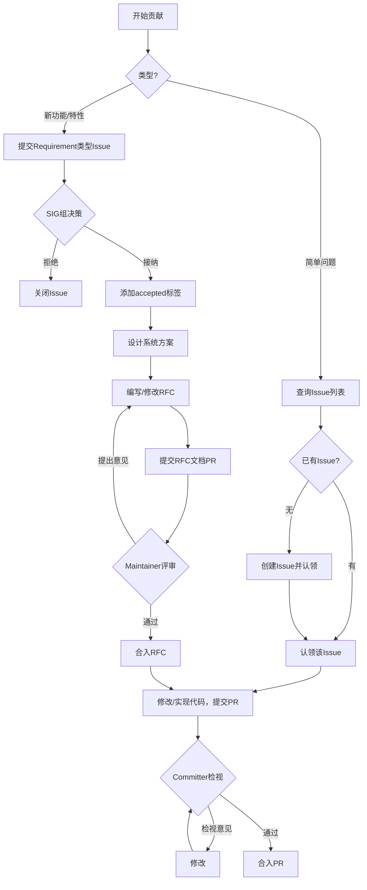

# 贡献指南

感谢您对HCCL的关注，本项目欢迎广大开发者体验并参与贡献。在参与社区贡献之前，请参见[cann-community](https://gitcode.com/cann/community)了解行为准则，进行 CLA 协议签署，了解源码仓的贡献流程。

## 期望的贡献

- 问题修复：修复自己发现的或在Issue列表中的Bug，比如代码中的逻辑错误、内存泄漏或崩溃等问题；
- 社区任务：领取HCCL社区公布的任务；
- 性能优化：针对特定算子或特定架构的性能优化；
- 新功能支持：增加框架功能、新算子或新业务场景的支持；
- 文档优化：改进文档、注释或使用用例。

## 预备知识

### 编码规范

请遵从[CANN 社区编码规范](https://gitcode.com/cann/community/tree/master/contributor/coding-standards)。

### PR规范

1. 提交 PR 时，请按照 PR 模板仔细填写本次 PR 的业务背景、目的、方案等信息；
2. **所有PR都必须关联Issue**，请在PR描述中引用对应的Issue编号；
3. 使用 Git 提交代码前，请参考 [pre-commit工具使用指导](./docs/zh/build/pre-commit-guide.md)，以保持代码风格一致且符合合规规范。
4. 若您的修改不是简单问题处理，而是涉及到新增功能、新增算子或算法、新增接口、新增配置参数或者修改代码流程等，请务必先通过 Issue 进行方案讨论，以避免您的代码被拒绝合入。若您不确定本次修改是否可被归为"简单问题处理"，亦可通过提交 Issue 进行方案讨论。

### 贡献目录

社区贡献比如新增算子/算法、扩展功能等统一提交到`experimental/`目录下，遵循以下策略。

- 原则上**尽量不改** `src/` 下的任何文件，避免污染主干稳定代码；
- 若确实需要修改 `src/`，必须在 PR 描述中显式说明原因与影响范围，并经 Committer 评审；
- PR 的代码差异应集中在 `experimental/` 目录内；
- 提供运行期开关，方便快速回退，详细规则请参阅 [experimental/README.md](./experimental/README.md)。

## 贡献流程

贡献可以分为两类：

- 简单问题处理：Bug修复、简单代码修改、文档修改等；
- 新功能或新特性：增加新功能、新算子或算法、新接口，或者支持新业务场景的贡献。

**整体流程**

### 简单问题处理

1. 查询并认领Issue

   - 现在Issue列表中查询该问题是否有对应的Issue；
   - **如有对应Issue**：直接认领该Issue；
   - **如无对应Issue**：创建新的Issue并认领。

2. 修改代码并提交PR

   - 需要满足编码规范与PR规范；
   - 确保包含触发Bug的回归测试。

3. 代码评审与合入

   - 负责对应模块或组件的Committer检视代码并反馈检视意见，请根据意见修改；没有问题后，添加`/lgtm`和`/approve`标签并合入。

### 增加新功能或新特性

1. 提交Requirement类型Issue

   - 在代码仓提交Requirement类型的Issue；
   - 详细描述：使用场景、业务价值、大致技术方案；
   - 在社区发起讨论，SIG组决策是否接纳该需求；如果接纳，添加`accepted`标签。

2. 提交取号 PR

   - 需求被接纳后，在 [RFC 编号登记表](./docs/zh/rfcs/INDEX.md) 中按"最小未使用编号"规则追加一行登记占位（状态=reserved）；
   - 提交**取号 PR**（仅含 INDEX.md 的一行更新），取号 PR 合入表示该编号可使用。

3. 系统方案设计

   - 在 `docs/zh/rfcs` 目录下创建 markdown 格式的 RFC 文档（文件名以登记的编号开头），并按 [RFC 模板](./docs/zh/rfcs/0000-template.md) 撰写系统方案；
   - 提交**RFC 文档 PR**。

4. 系统方案评审

   - 详细设计方案通过 RFC 文档 PR 进行评审；
   - 过程中请针对评审意见进行方案修改；

5. RFC合入

   - 所有Maintainer对方案均无异议后，由Maintainer添加`/lgtm`和`/approve`标签合入；
   - 合入的RFC方案作为后续代码实施的合约，代码实现需要遵循RFC方案；
   - RFC 文档 PR 合入后，需同步将 [RFC 编号登记表](./docs/zh/rfcs/INDEX.md) 中对应行状态从 `reserved` 改为 `accepted`。

6. 软件实现

   - 按照RFC方案实现代码，并提交PR；
   - 必须包含对应的测试代码（包含单元测试与系统测试）。

7. 代码评审与合入

   - 负责对应模块或组件的Committer检视代码并反馈检视意见，请根据意见修改；没有问题后，添加`/lgtm`和`/approve`标签并合入。

---

## 争议处理

存在争议的Issue、PR或RFC可以在[SIG工作会议](https://etherpad-cann.meeting.osinfra.cn/p/sig-hccl)上申报议题，由SIG组决策。

*本文档由社区维护，如有变更建议，请在Issue中提出。*
