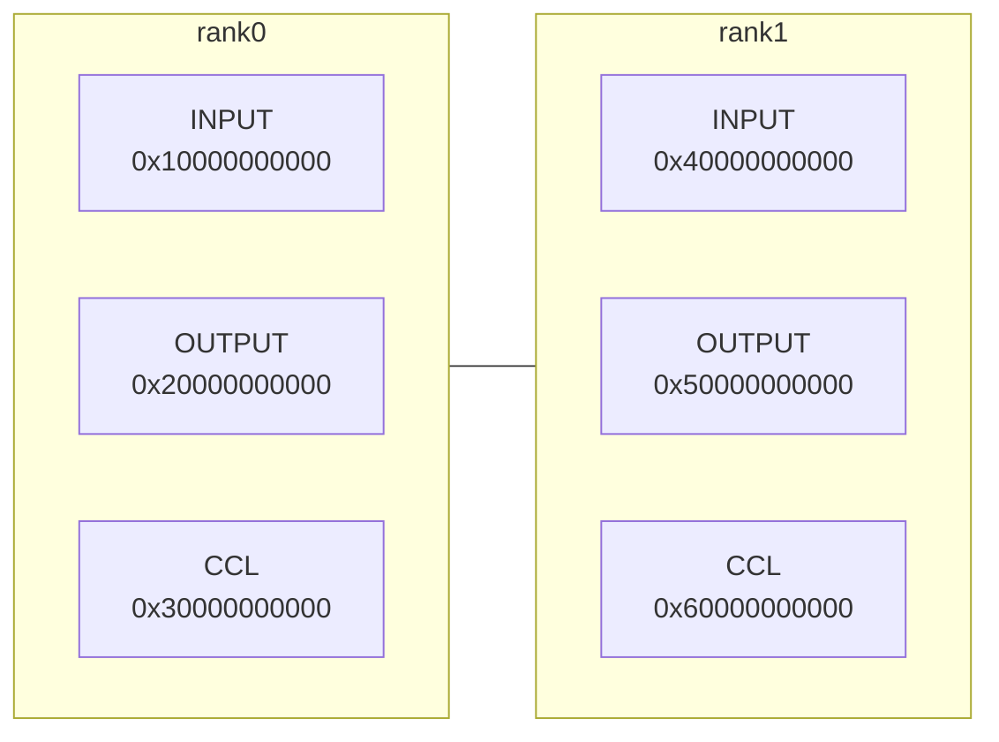

# 算法分析器使用指导

## 1.工具简介

HCCL算法分析器用于在离线环境中模拟HCCL算法的运行，验证算法逻辑及内存操作等功能，高效、快捷地执行测试任务，满足开发者的运行诉求。具体执行流程如下图：


## 2.前置依赖

st工程编译用到的软件依赖同hccl，详情请参照 [hccl源码构建-前置依赖](../../../docs/zh/build/build.md)

安装最新版本CANN Toolkit开发套件包 [下载链接](https://ascend.devcloud.huaweicloud.com/artifactory/cann-run-mirror/software/master/)

```bash
./Ascend-cann-toolkit_9.1.0_linux-x86_64.run --install --install-path=/home/Ascend
```

## 3.快速上手

### 3.1 编译安装算子包

```bash
# 在代码仓根目录执行
# 1.设置环境变量
source /home/Ascend/cann/set_env.sh
# 2.编译cann-hccl子包
bash build.sh
# 3.安装cann-hccl子包(安装路径与CANN Toolkit包路径一致)
./build_out/cann-hccl_9.1.0_linux-x86_64.run --full --install-path=/home/Ascend
```

### 3.2 编译st用例并执行

```bash
# 在代码仓根目录执行
# 1.编译并执行st用例
bash build.sh --st
```

### 3.3 运行结果查看

基于googletest测试框架的st用例程序执行结束后可在终端或重定向的日志文件中看到如下类似结果：

```bash
[----------] Global test environment tear-down
[==========] xxx tests from xx test suites ran. (xxxx ms total)
[  PASSED  ] xxx tests.
```

### 3.4 修改代码后再测试

- 如果修改非test目录代码，需要在修改代码后执行**3.1**和**3.2**章节步骤

- 如果修改test/st/algorithm代码，仅需执行**3.2**章节步骤

## 4.进阶指导

### 4.1 过滤用例执行

依赖googletest测试框架，我们可以在st工程的入口main函数(`hccl/test/st/algorithm/testcase/main.cc`)中按照如下方式过滤出想要执行的用例，默认是执行全量用例

```cpp
GTEST_API_ int main(int argc, char **argv)
{
    std::cout << "Start to run demo for hccl_checker_ops_stest." << std::endl;
    // case1: 仅执行ST_ALL_REDUCE_TEST测试套中的st_all_reduce_1shot_boundary_dataCount用例
    // testing::GTEST_FLAG(filter) = "ST_ALL_REDUCE_TEST.st_all_reduce_1shot_boundary_dataCount";

    // case1: 仅执行ST_ALL_REDUCE_TEST测试套中的所有用例
    // testing::GTEST_FLAG(filter) = "ST_ALL_REDUCE_TEST.*";
    testing::InitGoogleTest(&argc, argv);
    return RUN_ALL_TESTS();
}
```

### 4.2 TopoMeta结构

TopoMeta使用一个三层的vector来描述待测试的集群规格，用于描述有多少个超节点，每个超节点内有多少个Server，以及每个Server内有多少个NPU设备，初始化方式有如下两种：

- 方式1：

```cpp
// 单Server两卡
TopoMeta topoMeta{{{0, 1}}};
// 两个Server，每个Server两张卡
TopoMeta topoMeta{{{0, 1}, {0, 1}}};
```

- 方式2：

```cpp
TopoMeta topoMeta;
// 单Server两卡
GenTopoMeta(topoMeta, 1, 1, 2);
// 两个Server，每个Server两张卡
GenTopoMeta(topoMeta, 1, 2, 2);
```

### 4.3 GDB调试配置

使用st工程生成的可执行程序hccl_checker_ops_stest，可以参照如下步骤进行gdb调试：

```bash
# 在代码仓根目录下执行
# 1.设置环境变量(无需重复设置)
source /home/Ascend/cann/set_env.sh
# 2.配置LD_LIBRARY_PATH路径(注意your_hccl_path替换为自己本地的实际路径)
export LD_LIBRARY_PATH=/your_hccl_path/hccl/test/st/algorithm/build/utils/src/hccl_depends_stub:${ASCEND_HOME_PATH}/x86_64-linux/lib64
# 3.启动gdb调试
gdb ./test/st/algorithm/build/testcase/hccl_checker_ops_stest
```

### 4.4 日志等级控制

st工程对hccl的日志进行了打桩实现，通过`hccl/test/st/algorithm/utils/src/hccl_proxy/log_stub.cc`中的`logLevel`变量控制日志级别，默认0x03只打印ERROR级别日志

### 4.5 内存模型

每张rank的内存时虚拟分配的(所以不支持直接操作内存地址)，按照rank遍历分配，起始地址按照rank分配的示意图如下，定位地址报错时可根据日志查看操作的地址是否符合预期



## 5.问题定位

### 5.1 语义校验失败定位方法

#### 5.1.1 语义校验基础概念

算法分析器中内存使用相对地址进行表示，由三个字段组成：内存类型、偏移地址offset、大小size，用结构体DataSlice表示：

```cpp
class DataSlice {
private:
    BufferType type;
    u64        offset;
    u64        size;
}
```

内存支持Input、Output、CCL类型。

集合通信算法在运行过程中会涉及复杂的数据搬运、规约操作，算法分析器用**BufferSemantic（语义）**记录**数据搬运关系**，其中有目的内存表达和多个源内存表达。目的内存通过成员变量startAddr和Size表示；源内存用结构体SrcBufDes表示，结构体定义如下：

```cpp
struct BufferSemantic {
    u64                         startAddr;
    mutable u64                 size;       // 大小，源内存和目的内存共享相同的大小
    mutable bool                isReduce;   // 是否做了reduce操作，srcBufs有多个的时候必定是reduce场景
    mutable HcclReduce0p        reduceType; // reduce操作的类型
    mutable std::set<SrcBufDes> srcBufs;    //这块数据来自哪个或哪些rank
};

struct SrcBufDes {
    RankId      rankId;   // 数据源的rankId
    BufferType  bufType;   // 数据源的内存类型
    mutable u64 srcAddr;  // 相对于数据源内存类型的偏移地址
};
```

#### 5.1.2 语义计算举例

下面以具体例子介绍什么是语义计算。

1. 初始状态，有Rank0与Rank1两个Rank，有Input，Output两种内存类型。


2. 状态一动作：将rank0的Input，偏移地址20，大小为30的数据块搬运到rank0的Output，偏移地址为35结果：在rank0的Output上产生了一个语义块，记录了本次搬运的信息。


3. 状态二动作：将rank1的Input，偏移地址70，大小为15的数据块搬运到rank0的Output，偏移地址为50结果：目的内存与现有的语义块有重叠，需要对现有的语义块进行拆分，产生两条语义块。


#### 5.1.3 语义结果校验

语义分析执行的过程中产生很多语义块（即记录了很多数据搬运关系）。执行完成后，校验Output内存中的语义块是否符合预期。

接下来以2 rank做AllGather举例，说明Rank0的Output内存中语义块的正常场景和异常场景。假设输入数据大小是100字节。

- **正确场景：**


- **错误场景：**


#### 5.1.3 定位思路

语义校验阶段可以发现两种类型的错误：

- 数据缺失。
- 数据来源错误。

扩展到规约场景，也有类似的问题，比如参与规约的rank数量缺失、参与规约的数据偏移地址不一样等。通常情况下，语义报错的时候会给出一定的提示信息。需要借助提示信息，并结合算法分析器打印的task序列进行具体分析。